#

## What is Data?

=> Data are the raw facts, unorganized facts that need to be processed. Data can be something simple and seemingly random and useless until it is organized

## What is Information?

=> When data is processed, organized, structured or presented in a given context so as to make it useful, it is called information.

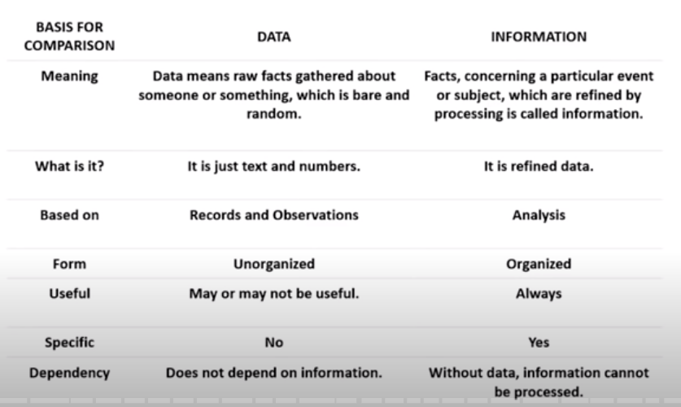

## Algorithm

=> Outline, the essence of a computational procedure, step by step instructions

## Program

=> An implementation of Algorithm in some programming language.

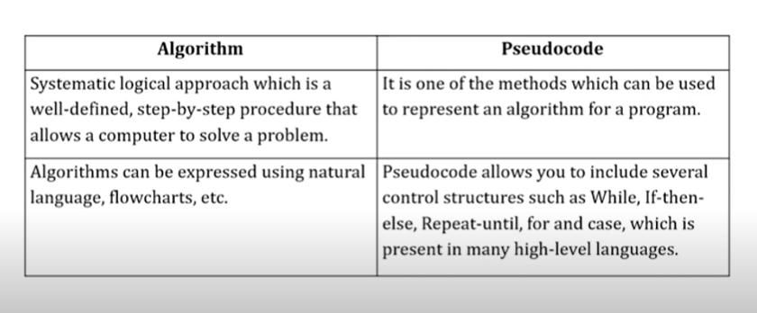

## Data Structure

=> is a way of collecting and organizing data in such a way that we can perform operations on these data in an effective way

### Types Of DS

1. **Primitive data structure**
   => they are the basic data structures that directly operate upon the machine instructions.
2. **Non-primitive data structure**
   => they are more complicated data structures and are derived from primitive data structures

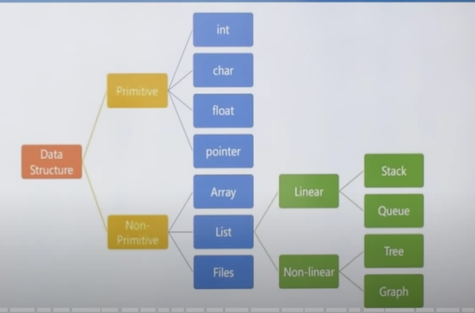

## Linear DS

- every item is related to it's previous and next item
- data is arranged in linear sequence
- data items can be traversed in a single run
- implementation is easy

## Non-linear DS

- every item is attached with many other items
- data is not arranged is sequence
- data cannot be traversed in a single run
- implementation is difficult

## Static and Dynamic DS

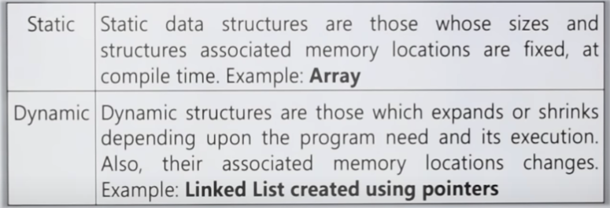

## Homogeneous and Non-Homogeneous DS

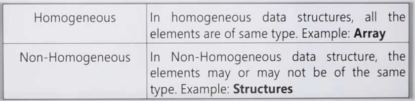

## What is a Good Algorithm?

Efficiency

- Running time
- Space used

## Measuring the running time

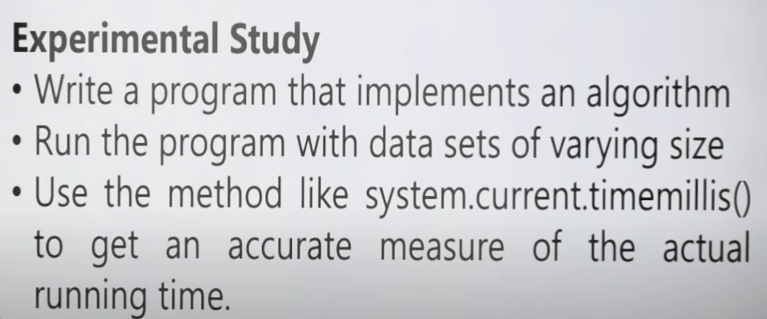

## Limitations of Experimental Study

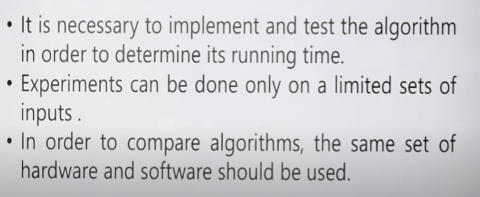

## Best/Worst/Average Case

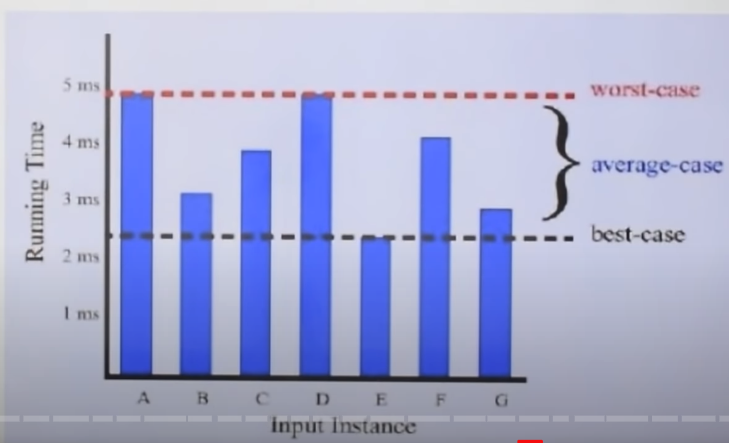

## Asymptotic Analysis

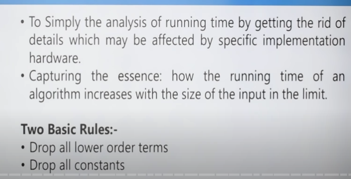

## Asymptotic Notations

=> Asymptotic notation of an algorithm is a mathematical representation of its complexity

There are three types of Asymptotic Notations...

1. Big-Oh
2. Big-Omega
3. Big-Theta

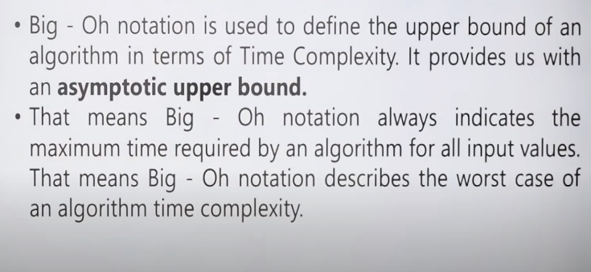

## Common Asymptotic Notations

```text
O(1)          --> constant
O(log n)      --> logarithmic
O(n)          --> linear
O(n^2)        --> quadratic
O(n^c)        --> polymonial or algebric
O(c^n) c > 1  --> exponential
```

## Array in DSA

==> Array is a collection of variables of same data type that share a common name
==> Array is an ordered set which consist of fixed number of elements
==> Array is an example of linear data structure

## One-D Array

==> LOC (A[i]) = Base_Address + w x (i)

Base_Address = 1st element address
w = word size / means no. of bytes occupied by each element.

## Two-D Array

==> LOC(A[i, j]) = Base_Address + W [M/N(i) + (j)]

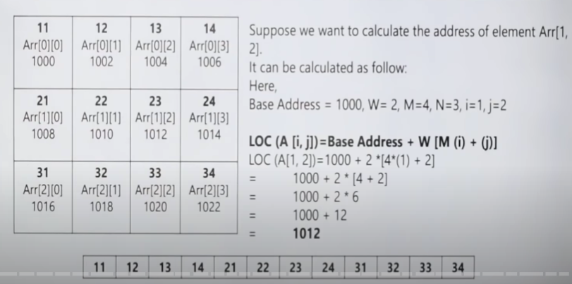

## Array's Pro

- Easy to create. Easy to use
- Direct indexing: O(1)
- Sequential access: O(N)

## Array's Cons

- Searching: O(N) and O(logN) if sorted
- inserting and deleting: O(N) because of shifting time

## Stack

--> data items are inserted and deleted one end only.
--> LIFO or FILO
--> It's a restricted DS
--> Operations-:

1. Push
2. Pop
3. Top
4. isEmpty

## Application of Stack

- Balancing of Symbols
- Redo-undo features at many places like editors, Photoshop.
- Forward and backward in web browsers
- Used in many algorithms like Tower of Hanoi, tree traversals, DFS search
- Conversion of polish notations
  1. infix notation - operator is between the operands: x + y
  2. prefix notation - operator is before the operands: + xy
  3. postfix notation - operator is after the operands: xy +
- To reverse a string
- when function (sub-program) is called
  when a function is called, the last one will be completed first. It is the property of Stack. There is a memory area specially reserved for this stack.

## Tower of Hanoi

A = 3 2 1
B =
C =

=>

A =
B =
C = 3 2 1

rule-1: move one at a time
rule-2: alltime decending order

Start the Algo-:

1. A -> C
2. A -> B
3. C -> B
4. A -> C
5. B -> A
6. B -> C
7. A -> C

so, when n = 3, transitions no. 7
so, total no. of transitions = 2^n - 1

## Recursive Method for Tower of hanoi

Tower(N, b, a, e)

Tower(N-1, b, e, a)

Tower(N-1, a, b, e)

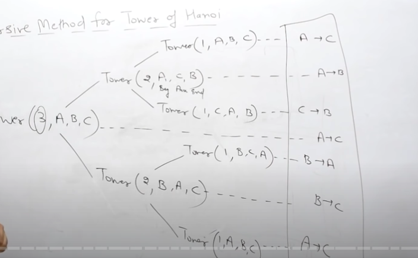

## Queue

- Linear Data Structure
- Restricted DS
- Based on FIFO Concept
- rear and font two parts for insertion and deletion purpose
