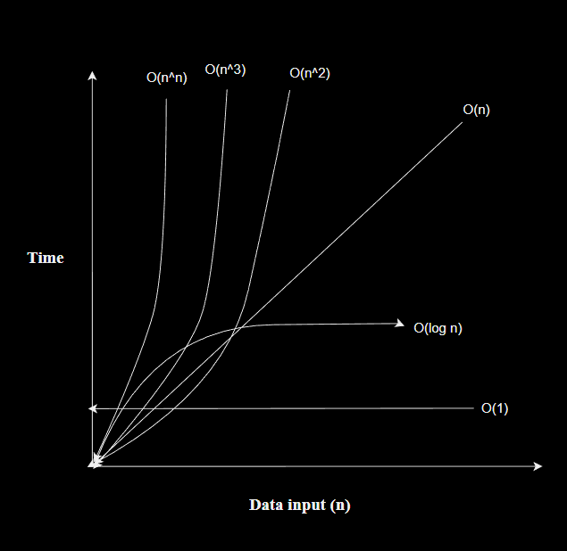

# DSA_JS

## Big-O

=> The big-O notation measures the worst case complexity of an algorithm. It tells, how efficient an algorithm is.

=> The question asked with big-O is the following. "What will hapen if n approaches infinity?" (n means inputs)

## some common Big-O notations



O(1) -: does not change with respect to input size.
Hence, O(1) is refered to as being constant time.
Example: accessing an item in an array by it's index.

O(n) -: is linear time and applies to algo that must do n operations in the worst-case scenario.
Example: printing numbers from 0 to n-1 for an array.

if there is 2 nested loop than it's O(n^2)
and if n nested loop than it's O(n^n)

Pattern Questions

Print these patterns using loops:

```text

1.  *****
    *****
    *****
    *****
    *****


2.  *
    **
    ***
    ****
    *****


3.  *****
    ****
    ***
    **
    *


4.  1
    1 2
    1 2 3
    1 2 3 4
    1 2 3 4 5


5.  *
    **
    ***
    ****
    *****
    ****
    ***
    **
    *


6.       *
        **
       ***
      ****
     *****


7.   *****
      ****
       ***
        **
         *


8.      *
       ***
      *****
     *******
    *********


9.  *********
     *******
      *****
       ***
        *


10.      *
        * *
       * * *
      * * * *
     * * * * *


11.  * * * * *
      * * * *
       * * *
        * *
         *


12.  * * * * *
      * * * *
       * * *
        * *
         *
         *
        * *
       * * *
      * * * *
     * * * * *


13.      *
        * *
       *   *
      *     *
     *********


14.  *********
      *     *
       *   *
        * *
         *


15.      *
        * *
       *   *
      *     *
     *       *
      *     *
       *   *
        * *
         *


16.           1
            1   1
          1   2   1
        1   3   3   1
      1   4   6   4   1


17.      1
        212
       32123
      4321234
       32123
        212
         1


18.   **********
      ****  ****
      ***    ***
      **      **
      *        *
      *        *
      **      **
      ***    ***
      ****  ****
      **********


19.    *        *
       **      **
       ***    ***
       ****  ****
       **********
       ****  ****
       ***    ***
       **      **
       *        *


20.    ****
       *  *
       *  *
       *  *
       ****

21.    1
       2  3
       4  5  6
       7  8  9  10
       11 12 13 14 15

22.    1
       0 1
       1 0 1
       0 1 0 1
       1 0 1 0 1

23.        *      *
         *   *  *   *
       *      *      *

24.    *        *
       **      **
       * *    * *
       *  *  *  *
       *   **   *
       *   **   *
       *  *  *  *
       * *    * *
       **      **
       *        *

25.       *****
         *   *
        *   *
       *   *
      *****

26.   1 1 1 1 1 1
      2 2 2 2 2
      3 3 3 3
      4 4 4
      5 5
      6

27.   1 2 3 4  17 18 19 20
        5 6 7  14 15 16
          8 9  12 13
            10 11

28.      *
        * *
       * * *
      * * * *
     * * * * *
      * * * *
       * * *
        * *
         *

29.
       *        *
       **      **
       ***    ***
       ****  ****
       **********
       ****  ****
       ***    ***
       **      **
       *        *

30.         1
          2 1 2
        3 2 1 2 3
      4 3 2 1 2 3 4
    5 4 3 2 1 2 3 4 5


31.      4 4 4 4 4 4 4
         4 3 3 3 3 3 4
         4 3 2 2 2 3 4
         4 3 2 1 2 3 4
         4 3 2 2 2 3 4
         4 3 3 3 3 3 4
         4 4 4 4 4 4 4

32.    E
       D E
       C D E
       B C D E
       A B C D E

33.    a
       B c
       D e F
       g H i J
       k L m N o

34.    E D C B A
       D C B A
       C B A
       B A
       A

35.    1      1
       12    21
       123  321
       12344321
```

## integer Rounding

=> integr division does not work in JS.
for example-: 5 / 4 => 1.25

=> so for this we need Math object.

Math.floor = rounds down to nearest integer
Math.round = rounds to nearest integer
Math.ceil = rounds up to nearest integer

Example-:

Math.floor(0.9) // 0
Math.floor(1.1) // 1

Math.round(0.499) // 0
Math.round(0.5) // 1

Math.ceil(0.1) // 1
Math.ceil(0.9) // 1

## Maximums

Number.MAX_SAFE_INTEGER = largest integer

Number.MAX_SAFE_INTEGER + 1 === Number.MAX_SAFE_INTEGER + 2 // true
because it can't go any higher

but it does not work for floating-point decimals

Number.MAX_SAFE_INTEGER + 1.1223 === Number.MAX_SAFE_INTEGER + 4.3322 // false

## Size Summary

```text
-infinity < Number.MIN_SAFE_INTEGER
  < Number.Min_VALUE < 0
  < Number.MAX_SAFE_INTEGER < Number.MAX_VALUE
  < infinity

```

## Number Algorithms

==> One of the most popular algorithm involving numbers is for testing whether a number is prime or not.

prime number-: only divisible by 1 and itself.
Examples: 2, 3, 5, 7, 11, 13, 17, 19, 23, 29

algo(1)-: O(n)

- input n;
- itearte from 2 to n (exclude n)
- loop-: if n % i === 0 return false
- return true

```code
const isPrime = (n) => {
  for (let i = 2; i < n; i++) {
    if (n % i === 0) return false;
  }
  return true;
};

// 2, 3, 5, 7, 11, 13, 17, 19, 23, 29
if (isPrime(29)) {
  document.write("Wow! 😃, It's A Prime!");
} else {
  document.write("Opps! 🙂, Not A Prime!");
}

```

This algo can be easily improved by ignoring multiple of 2s, Hence the loop size reduced by half of n.

algo(2)-:

- input n
- iterate 2 to n / 2
- loop-: if n % i === 0 return false
- return true

```code
const isPrime = (n) => {
  for (let i = 2; i <= n / 2; i++) {
    if (n % i === 0) return false;
  }
  return true;
};

```

but more optimization posible

Ok, let's first see some prime numbers-:
2, 3,
5, 7, 11,
13, 17, 19,
23, 29,
31, 37,
41, 43, 47,
53, 59,
61, 67,
71, 73, 79

It's hard to see, but all primes are of the form of 6k +/- 1 (k is some integer) except 2 and 3
5 = 6 x 1 - 1
7 = 6 x 1 + 1
11 = 6 x 2 -1

algo(3)-:

- input n
- if n <= 1 return false
- if n <= 3 return false
- if [ n % 2 === 0 or n % 3 === 0 ] return false
- The loop starts from i = 5 and continues as long as i x i is less than or equal to n. This is an optimization because if a non-prime number has a factor greater than its square root, it must also have a factor smaller than its square root. So we just need to check only up to the square root of n.

```code
const isPrime = (n) => {
  if (n <= 1 || n <= 3) return false;
  if (n % 2 === 0 || n % 3 === 0) return false;
  for (let i = 5; i * i < n; i = i + 6) {
    if (n % i === 0 || n % (i + 2) === 0) return false;
  }
  return true;
};

```

## Prime Factorization

// Prime factorization is the process of breaking down a composite number into its prime factors, which are the prime numbers that multiply together to give the original number. This is an important concept in number theory and has various applications in mathematics and computer science. There are several algorithms for prime factorization, with some of the most commonly used ones being trial division, Pollard's rho algorithm, and the quadratic sieve. The first algorithm is the simplest and most intuitive, but it is also the slowest. The second algorithm is faster than the first, but it is still too slow for large numbers. The third algorithm is the fastest, but it is also the most complicated.

// **_Trial Division Algorithm:_**
The trial division algorithm is a straightforward method for finding the prime factors of a number 'n'.

1. start with the number you want to factor, 'n', and initialize a variable, say 'divisor' = 2
2. While 'n' is greater than 1
   a. Check if 'n' is divisible by 'divisor'
   b. if it is divisble, divide 'n' by 'divisor' and record 'divisor' as one of the prime facotrs.
   c. if it is not divisible, increment 'divisor' by 1 and continue to the next iteration.
3. Repeat step 2 until 'n' becomes 1
4. The recorded divisors are the prime factors of the original number

```code
const primeFactorization = (n) => {
  let record = [];
  let divisor = 2;
  while (n > 1) {
    if (n % divisor === 0) {
      record.push(divisor);
      n = n / divisor;
    } else divisor++;
  }
};


```
